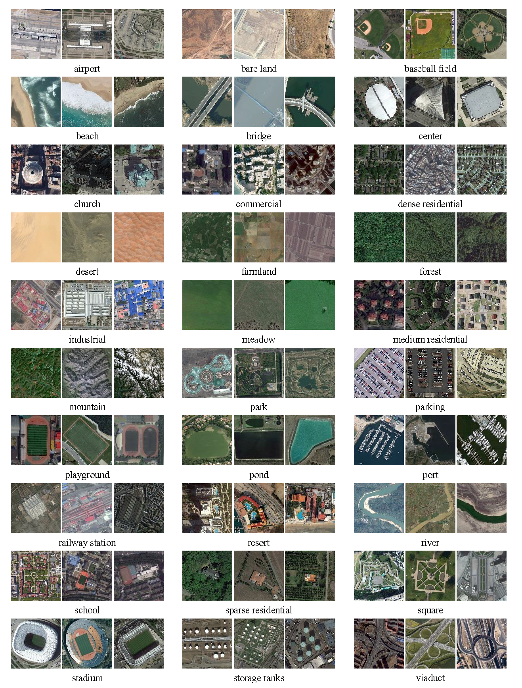

[中文说明](./readme_zh.md)  
# Why

When we deal with remote sensing problems, ImageNet pre-training weights are often used to initialize the pre-network. The natural image is quite different from remote sensing (scene) image, so the amount of data and the number of iterations are higher needed. So, I trained some basic convolutional neural networks on some public datasets, hoping to migrate better and faster.

# How

This code used pytorch=1.4.0, python3.6.10. GPU:1050Ti(4G). 

You can download weights in [Releases](https://github.com/lsh1994/remote_sensing_pretrained_models/releases).  

For example, you can code as blow get model:

```python
import torch
from albumentations.pytorch import ToTensorV2
import model_finetune
import cv2
import albumentations as alb

# 模型加载样例
weights = torch.load(r"output\resnet34-epoch=9-val_acc=0.953.ckpt")["state_dict"] # 模型权重
for k in list(weights.keys()):
    weights[str(k)[4:]]=weights.pop(k)

net = model_finetune.ResNet("resnet34",30)
net.load_state_dict(weights) # 加载权重字典
print(net)

```
Test a image:
```python
labels_dict = ['Airport', 'BareLand', 'BaseballField', 'Beach', 'Bridge', 'Center', 'Church', 'Commercial', 'DenseResidential',
     'Desert', 'Farmland', 'Forest', 'Industrial', 'Meadow', 'MediumResidential', 'Mountain', 'Park', 'Parking',
     'Playground', 'Pond', 'Port', 'RailwayStation', 'Resort', 'River', 'School', 'SparseResidential', 'Square',
     'Stadium', 'StorageTanks', 'Viaduct']

image = cv2.imread(r"E:/MLDataset/Classify/AID/AID/Port\port_120.jpg", cv2.IMREAD_COLOR)
image = cv2.cvtColor(image, cv2.COLOR_BGR2RGB)
transforms_train = alb.Compose([
        alb.Resize(height=224, width=224, p=1),
        alb.Normalize(p=1.0),
        ToTensorV2(p=1.0),
    ])
image = transforms_train(image=image)['image']
image = torch.unsqueeze(image,dim=0)

output = net(image)
output = torch.softmax(output,dim=1)
index =torch.argmax(output[0]).item()
print(output)
print(output[0,index].item(),labels_dict[index])
```

# Result

Training scripts are relatively rudimentary and similar.If you want to get better test set precision or generalization ability, you can use better and more data enhancement, regularization techniques and training strategies.

## AID
[AID: A Benchmark Dataset for Performance Evaluation of 
Aerial Scene Classification](http://captain.whu.edu.cn/WUDA-RSImg/aid.html)

The data set has 10,000 600x600 images and 30 categories.  
  

Reference "eda.ipynb" for more information.

Resize to 224x224.
 
Network | Iterations | batch_size | validation set acc  
:-: | :-: | :-: | :-:  
resnet34 | 200 | 256 | 0.9540 
 ResNet50 | 200 | 128 | 0.9951 